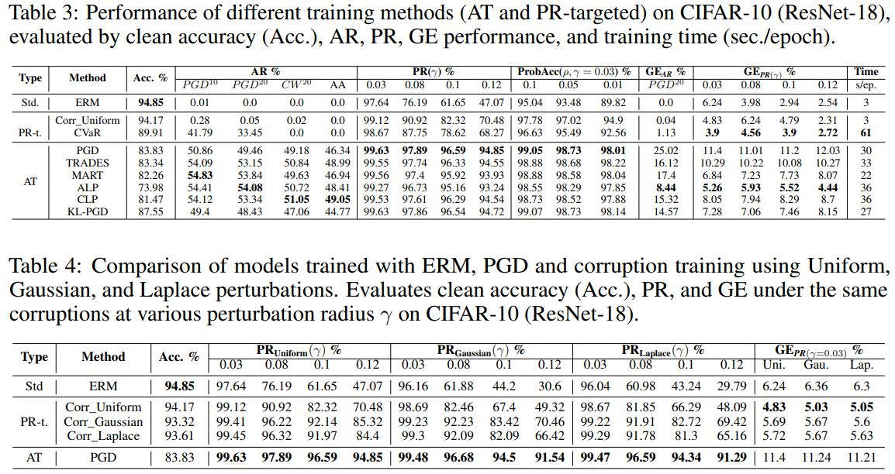

# Probabilistic Robustness for Free? Revisiting Its Training with Benchmarking

This repository is the official implementation of [Probabilistic Robustness for Free? Revisiting Its Training with Benchmarking](https://arxiv.org/abs/2030.12345). 


## Requirements

To install requirements:

```setup
pip install -r requirements.txt
```


## Training

To train the model(s) in the paper, run this command:

```train
bash run.sh

eg.
python main.py \
    --dataset CIFAR10 \
    --data_root ./dataset/cifar_10 \
    --model_name resnet18 \
    --input_size 32 \
    --model_depth 28 \
    --model_width 10 \
    --num_class 10 \
    --lr 0.1 \
    --batch_size 256 \
    --weight_decay 5e-4  \
    --epochs 100 \
    --save_path new_out/cifar10_res18/AT_Clean \
    --attack Clean \
    --attack_steps 10 \
    --attack_eps 8.0 \
    --attack_lr 2 \
    --phase train \
    --beta 6.0 
```

## Evaluation

To evaluate my model on ImageNet, run:

```eval
python main.py \
    --dataset CIFAR10 \
    --data_root ./dataset/cifar_10 \
    --model_name resnet18 \
    --input_size 32 \
    --model_depth 28 \
    --model_width 10 \
    --num_class 10 \
    --lr 0.1 \
    --batch_size 256 \
    --weight_decay 5e-4  \
    --epochs 100 \
    --save_path new_out/cifar10_res18/AT_Clean \
    --attack Clean \
    --attack_steps 10 \
    --attack_eps 8.0 \
    --attack_lr 2 \
    --phase eval \
    --beta 6.0 
```


## Pre-trained Models

You can download pretrained models here:

- [My model](https://drive.google.com/mymodel.pth) 


## Results

Our model achieves the following performance on :

### [Image Classification on CIFAR-10]
<p align="center">
    
</p>


## Contributing

We welcome contributions to this repository!

If you'd like to contribute:

1. Fork the repository.
2. Open a pull request describing your changes.

For any major changes, please open an issue first to discuss what you would like to change.

## 📄 License

This code is released under the [MIT License](LICENSE).
